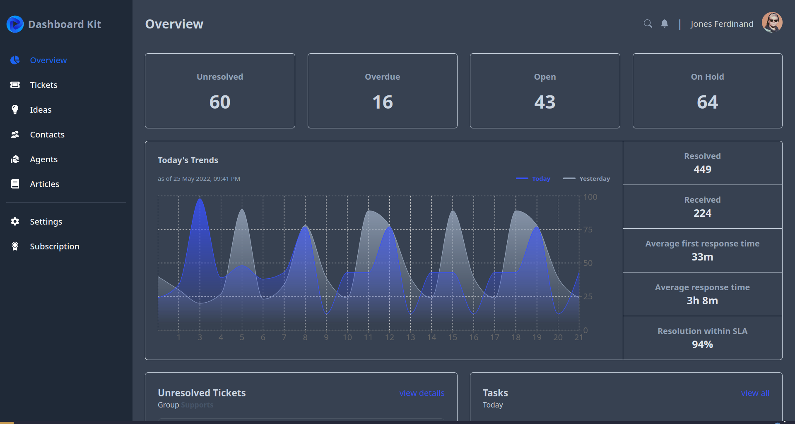

<div align="center">

<!-- PROJECT LOGO -->


</div>

# Dashboard Kit

Implementation of dashboard UI design into website.

<!-- ## ✨ Demo

Here is a working live demo : https://anime-war-rizalyoga.vercel.app/ -->

## 🎥 Video Demo

[dashboard-demo.webm](https://github.com/rizalyoga/dashboard-kit/assets/28485636/79cf1f95-81d3-4821-a3d0-8f6831b51bd8)

## 🔮 Features

- Login account admin & user (admin account : michaelw, pass: michaelwpass | user account: emilys, pass: emilyspass)
- Sort data by name
- Sort data by date
- Filter data by priority
- Create new ticket
- Dark Mode

## 🖼️ Pages

|           Login Page Light Mode           |         Login Page Dark Mode         |
| :---------------------------------------: | :----------------------------------: |
|     |     |
|      <b>Overview Page Light Mode</b>      |    <b>Overview Page Dark Mode</b>    |
|  |  |
|       <b>Ticket Page Light Mode</b>       |    <b>Ticket Page Light Mode</b>     |
|      |    |

## 🧰 Run in locale

To clone and run this website, you'll need [Git](https://git-scm.com) and [Node.js](https://nodejs.org/en/download/) (which comes with [yarn](https://yarnpkg.com/)) installed on your computer. From your command line:

```bash
# Clone this repository
$ git clone https://github.com/rizalyoga/dashboard-kit.git

# Go into the repository
$ cd dashboard-kit

# Install dependencies
$ yarn

# Run the app
$ yarn dev
```

## ⛏️ Built with

- [React JS](https://react.dev/) - React is a JavaScript library used to build component-based interactive user interfaces. React is created by Facebook and is open-source, so anyone can use it for free.
- [Node JS v20.4.0](https://nodejs.org/id) - Node.js is an open-source, cross-platform JavaScript runtime environment.
- [Yarn](https://yarnpkg.com/) - Yarn is a package manager that doubles down as project manager.

## 👤 Authors

- [Rizalyoga](https://github.com/rizalyoga/)
